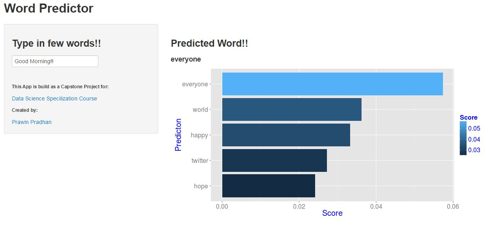

                    Word Predictor
========================================================
author: Prawin Pradhan
date: 14th Dec 2014
transition: rotate

                      Purpose
========================================================
type: section

This simple app can be used to predict the next word that the user wants to type. This app is hosted in the [Shinyapps](https://prawinpradhan.shinyapps.io/WordPredictor/).

Building the App
========================================================
type: section

Various stages were involved while developing this app.
  - Text data from News,blogs and twitter were used. This was provided by Swiftkey and Coursera, which is available [here](https://d396qusza40orc.cloudfront.net/dsscapstone/dataset/Coursera-SwiftKey.zip)
  - A large text corpus was created using this data.
  - This text corpus was then cleaned and randomly sampled (approx 10 percent).
  - Samples were then divided in word groups of two,three and four words and their conditional probability with the prior (n-1)words (where n is the number of words) was calculated and stored in a dataset.
  - A simple blend of ***Interpolation*** and ***Stupid back-off*** Algorithm ([video link here](https://www.youtube.com/watch?v=-aMYz1tMfPg)) was developed to balance the speed,accuracy and size limitation of the Predictive Model.
  

Word Predictor App
========================================================
type: section

Using the Model is very simple.

  - Start by typing any text.
  - The input text is cleaned and then matched with 4-grams,3-grams and 2-gram words present in Dataframe.
  - The scores with proir words are pre-calculated in the dataframe.
  - 
  - This App also shows a relative ***Score*** of prediction for the top 5 words predicted.
  
Conclusion
========================================================
type: section
Areas of improvement
  - Increase the prediction accuracy by sampling more data.
  - Using efficient data types,index,etc for faster searches and low memory uses.  
  
Acknowledgement
  - Special thanks to **Jeff Leek, PhD, Roger D. Peng, PhD, Brian Caffo, PhD.** Coursera Data Science Faculty.
  - I would also like to express my gratitude towards **Rodrigo Bertollo de Alexandre,Maher Harb,Patrick Chamberlain,Maher Harb** for their always available guidence in the Class forums.

  
